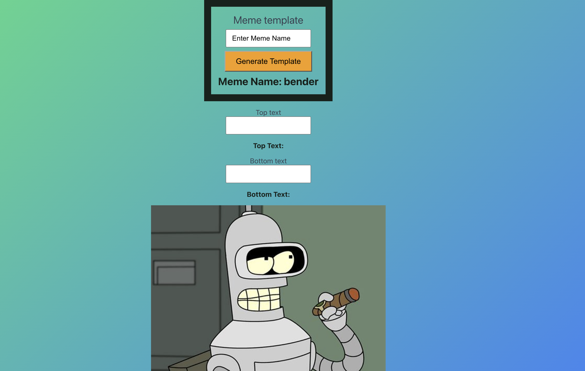
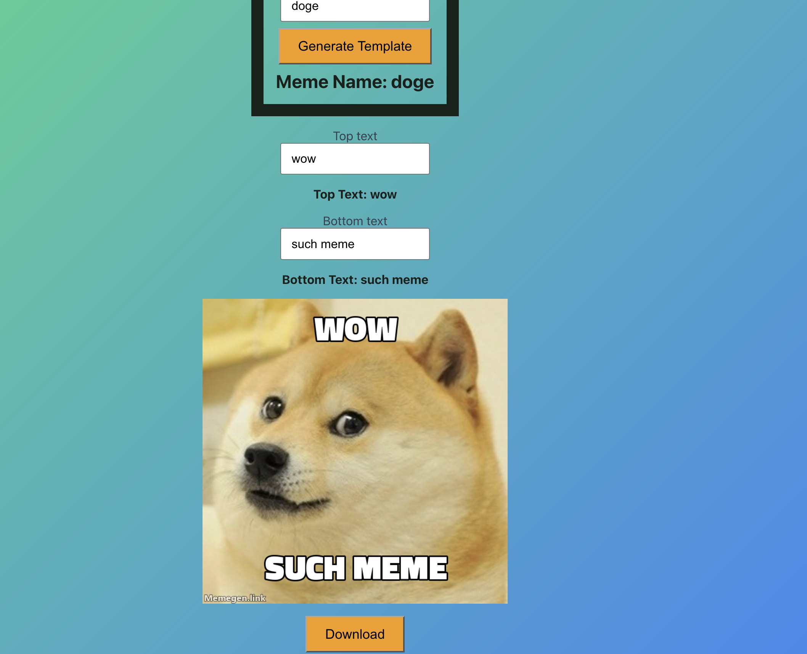

# React Meme Generator

This is web app fetches oldschool Memes from `https://memegen.link/` using their API.

## Customize it

The user can:

- search for a template
- enter a text for the top
- enter a text for the bottom

## Download it

After the Meme is generated, the user can download it as a .png

## Examples

  
  

